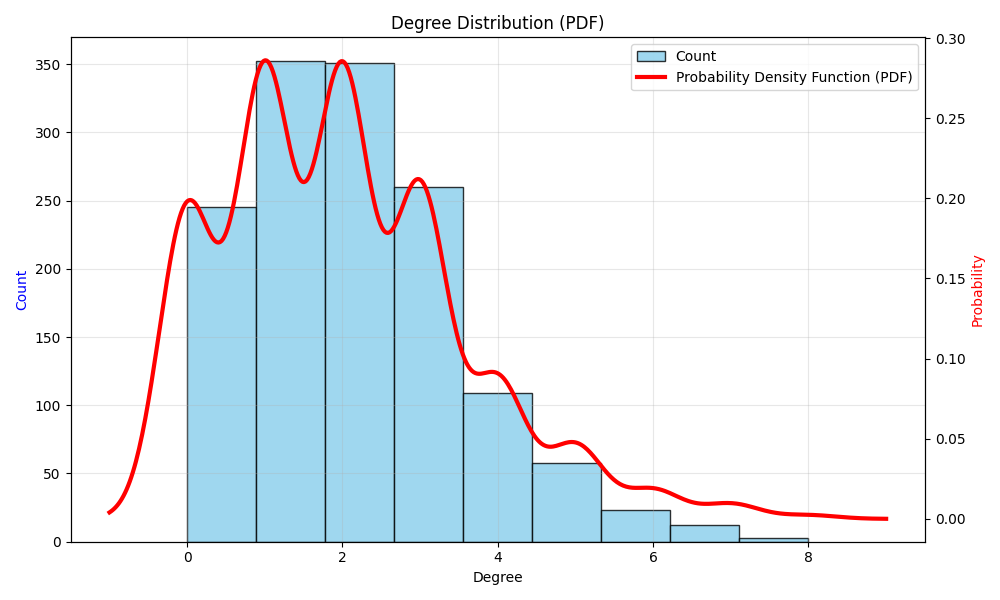
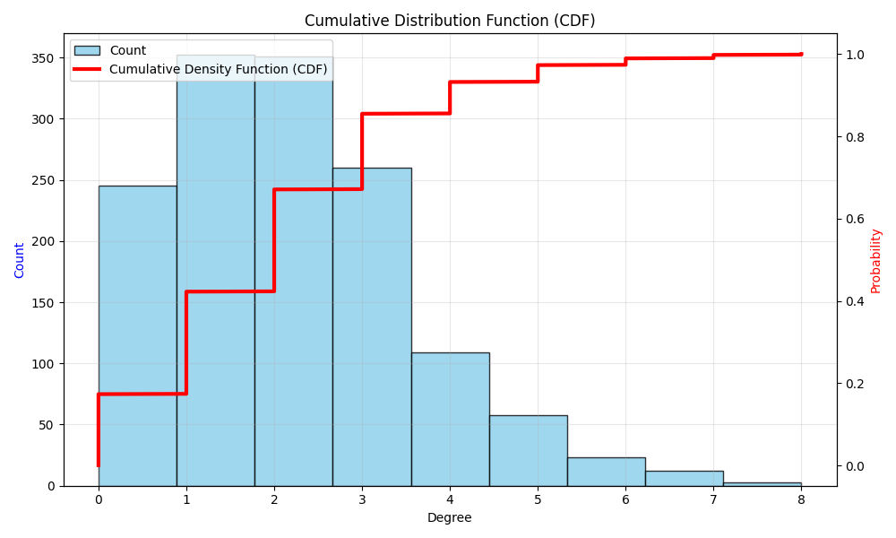
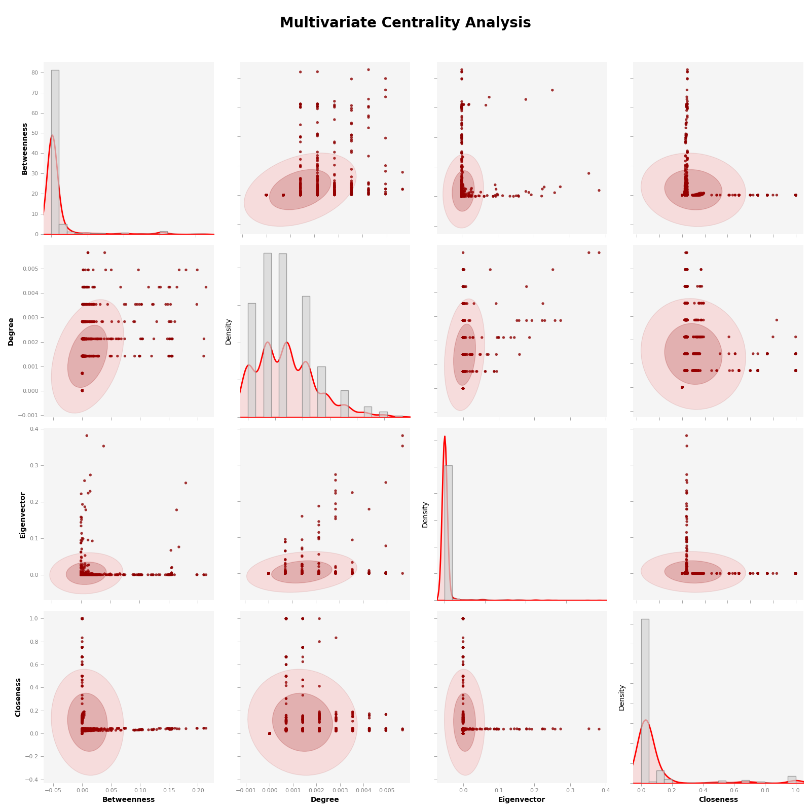
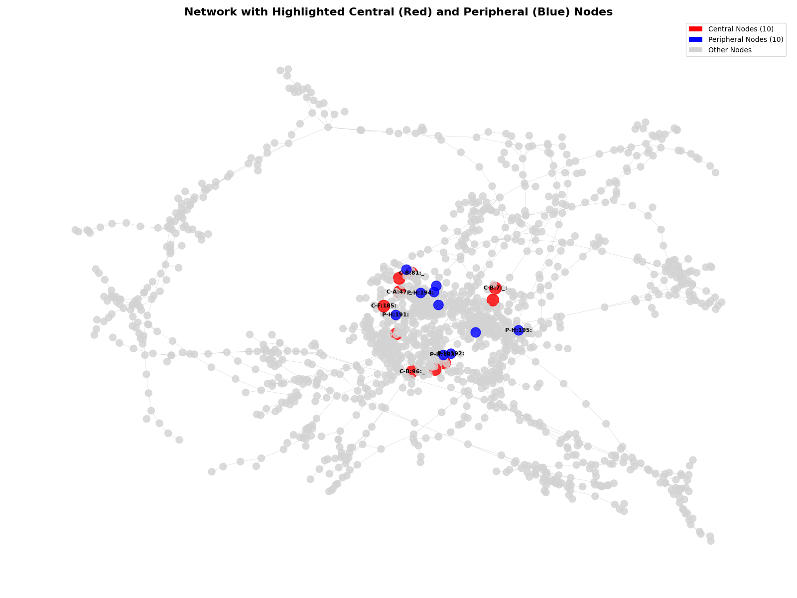

## README: Análise de Rede e Métricas de Centralidade

Este repositório contém um script Python para carregar e analisar grafos no formato GEXF, focando na distribuição de graus e em várias métricas de centralidade. Os resultados da análise são visualizados através de diferentes gráficos, que são salvos automaticamente em uma pasta com timestamp para cada execução.

### Estrutura do Projeto

* `aed2.py`: O código principal para a análise da rede.
* `final_netwokr.gexf`: O arquivo de grafo GEXF que é analisado.
* `network_analysis_results_20250718_190609`: Uma pasta gerada automaticamente a cada execução, contendo todos os gráficos resultantes.

### Gráficos Gerados e Suas Explicações

A seguir, uma explicação detalhada de cada tipo de gráfico gerado pelo script:

---

### 1. Distribuição de Grau (PDF - Probability Density Function)

Este gráfico exibe a distribuição dos graus dos nós na rede. O grau de um nó é o número de conexões (arestas) que ele possui.

* **Barras Azuis (Count)**: Representam um **histograma** da frequência dos graus. A altura de cada barra indica quantos nós na rede têm aquele grau específico. Por exemplo, a barra mais alta em torno do grau 1 ou 2 indica que a maioria dos nós na rede tem 1 ou 2 conexões.
* **Linha Vermelha (Probability Density Function - PDF)**: Esta curva é uma **Estimativa de Densidade de Kernel (KDE)**. Ela fornece uma representação suave e contínua da distribuição subjacente dos graus. A PDF ajuda a visualizar a forma geral da distribuição de probabilidade dos graus, mesmo que os graus sejam valores discretos. Picos na curva indicam graus mais comuns, enquanto caudas mais longas mostram a presença de alguns nós com muitos vizinhos (hubs).

---

### 2. Função de Distribuição Cumulativa (CDF - Cumulative Distribution Function)

Este gráfico mostra a Função de Distribuição Cumulativa dos graus da rede.

* **Barras Azuis (Count)**: Similar ao gráfico PDF, estas barras representam o histograma da contagem de graus.
* **Linha Vermelha (Cumulative Density Function - CDF)**: Esta curva mostra a **probabilidade acumulada** de um nó ter um grau menor ou igual a um determinado valor. Para dados discretos, como os graus de nós, a CDF é **naturalmente uma "escada"**. Cada "degrau" indica um salto na probabilidade acumulada quando um novo valor de grau é incluído na contagem. Por exemplo, o valor da CDF em grau `k` indica a proporção de nós que têm `k` ou menos conexões. A curva sempre varia de 0 a 1 (ou 0% a 100%).

---

### 3. Análise de Centralidade Multivariada

Este gráfico é uma matriz de gráficos que permite visualizar as relações e distribuições entre várias métricas de centralidade da rede. As métricas de centralidade avaliam a "importância" ou "influência" de um nó dentro do grafo. As métricas usadas são: **Betweenness (Intermediação)**, **Degree (Grau)**, **Eigenvector (Autovetor)** e **Closeness (Proximidade)**.

* **Diagonal (Histogramas/Densidade de KDE)**: Os gráficos na diagonal da matriz mostram a **distribuição individual** de cada métrica de centralidade. Semelhante à PDF do grau, eles usam histogramas e curvas de densidade (KDE) para ilustrar como os valores de cada métrica estão distribuídos entre os nós da rede. É comum observar distribuições assimétricas, com muitos nós tendo baixa centralidade e poucos sendo altamente centrais.
* **Fora da Diagonal (Gráficos de Dispersão com Elipses de Densidade)**: Cada gráfico fora da diagonal é um **gráfico de dispersão** que mostra a relação entre duas métricas de centralidade diferentes.
    * Os **pontos vermelhos** representam os nós da rede, com suas coordenadas dadas pelos valores das duas métricas correspondentes.
    * As **elipses vermelhas com preenchimento (mais claro no exterior, mais escuro no interior)** indicam a **densidade de concentração dos pontos**. Elas ajudam a visualizar onde a maioria dos nós se agrupa em relação a essas duas métricas. Elipses alongadas sugerem uma correlação entre as métricas, enquanto elipses mais arredondadas ou dispersas indicam menor correlação ou que as métricas capturam aspectos distintos da centralidade.

---

### 4. Visualização da Rede com Nós Centrais e Periféricos Destacados

Este gráfico é uma representação visual da rede, onde os nós são coloridos e dimensionados com base em sua centralidade combinada.

* **Nós Vermelhos (Grandes)**: Representam os **Nós Centrais** da rede. São os nós que possuem os maiores valores nas métricas de centralidade, indicando que são os mais importantes ou influentes.
* **Nós Azuis (Médios)**: Representam os **Nós Periféricos** da rede. São os nós com os menores valores nas métricas de centralidade combinadas, localizados nas "bordas" ou com menor influência na estrutura geral.
* **Nós Cinza Claro (Pequenos)**: Representam os demais nós da rede que não se enquadram nas categorias de centrais ou periféricos de topo/fundo.
* **Linhas Cinzas (Arestas)**: Representam as conexões entre os nós.
* **Layout da Rede**: O algoritmo de layout (neste caso, `spring_layout`) tenta posicionar os nós de forma que as conexões sejam curtas e as não-conexões sejam longas, revelando a estrutura subjacente da rede.

Esta visualização ajuda a identificar visualmente os "hubs" e os "isolados" da rede, mostrando onde a maior parte da atividade ou influência pode estar concentrada.