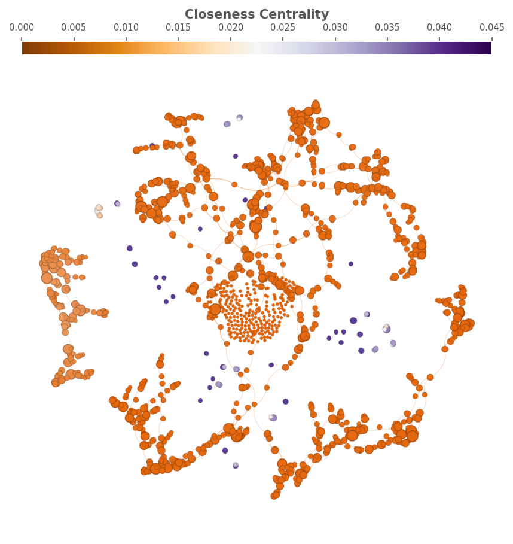

# Projeto Final - AED II (Parte 2)

**Apresentação:** (link da apresentação)

## Integrantes do grupo:
* Gustavo Pereira de Carvalho
* André Luiz Lima Souza
* Celine Helena Abrantes de Andrade

## Contextualização
Este projeto representa a segunda parte do trabalho final da disciplina de **Algoritmos e Estruturas de Dados II**. O objetivo do repositório é relatar o desenvolvimento do projeto e agrupar os resultados obtidos, aplicando conceitos de grafos e análise de redes para explorar e visualizar propriedades estruturais de uma rede complexa. Dessa forma, dentre as sugestões apresentadas em sala, foi escolhida a análise de uma rede de interação de resíduos, que descreve a organização de uma proteína. Nesse caso, a proteína escolhida foi a **Proteína Precursora Amiloide (APP)**.

A escolha da APP se deve à sua grande relevância biomédica, sendo uma das protagonistas no desenvolvimento da **Doença de Alzheimer**. A APP é a fonte dos peptídeos beta-amiloide, que se agregam para formar as placas senis características da doença, consequência de uma clivagem anormal da APP. Essa relação é a base da principal hipótese sobre a causa da doença, conhecida como "Hipótese da Cascata Amiloide". A análise de sua estrutura como uma rede de interações permite investigar como a estabilidade da proteína é mantida e quais resíduos são os pontos-chave. Identificar esses resíduos críticos através da análise de grafos nos ajuda a entender os mecanismos que levam à sua clivagem anormal e pode revelar novos alvos para futuras estratégias terapêuticas contra o Alzheimer.

## Requisitos

### Requisito #01: Análise de Centralidade
Para atender ao primeiro requisito, foram gerados quatro grafos diferentes destacando diferentes tipos de centralidade: a **centralidade de grau (Degree Centrality)**, **centralidade de proximidade (Closeness Centrality)**, **centralidade de intermediação (Betweenness Centrality)** e **centralidade de autovetor (Eigenvector Centrality)**.

* A **centralidade de grau** representa o número de conexões que um vértice possui. Um nó com alto grau é diretamente conectado a muitos outros, sugerindo uma alta influência e visibilidade.
* A **centralidade de intermediação** representa o quanto um nó faz parte do caminho mais curto entre outros pares de nós, agindo como ponte ou nó intermediário. Nós com alta intermediação podem controlar o fluxo na rede e são importantes para ligar comunidades ou regiões separadas do grafo.
* A **centralidade de proximidade** mede o quão próximo um nó está de todos os outros na rede, com base no menor caminho. Um nó com alta proximidade pode alcançar outros nós rapidamente, indicando sua importância para difundir informação na rede.
* Por fim, a **centralidade de autovetor** considera, além do número de conexões, a importância dos vizinhos de um nó. Um nó com alta centralidade de autovetor está ligado a outros com alta importância, representando sua influência estrutural.

### Requisito #02: Análise de K-core
O segundo requisito é destacar o **k-core** e o **k-shell** da rede, uma métrica importante para determinar o “núcleo” mais importante, conectado e influente. Essa análise é útil para identificar os elementos mais resilientes a falhas ou entender os "superespalhadores" em uma rede de contatos, em diferentes aplicações.

* O **k-shell** representa o conjunto de nós que pertencem ao k-core, mas não ao (k+1)-core, funcionando como uma “casca” que envolve o núcleo mais conectado.
* O **k-core** de um grafo representa o subgrafo máximo no qual todos os nós têm grau maior ou igual a *k*. Essa operação é chamada de decomposição e começa com a remoção de todos os nós com grau menor que *k*, atualizando os graus restantes até que restem apenas nós com grau maior ou igual a *k* no subgrafo.

### Requisito #03: Análise de CDF, PDF e análise multivariável das métricas de centralidade
O terceiro requisito consiste em gerar dois gráficos, **Probability Density Function (PDF)** e **Cumulative Distribution Function (CDF)**, além de uma análise multivariável das métricas de centralidade através de uma **Matriz de Gráficos de Dispersão**.

* O gráfico de **PDF** nos mostra onde as probabilidades estão mais concentradas. O pico do gráfico representa os valores mais comuns, e os vales, os mais raros.
* O gráfico de **CDF** representa o acúmulo dos dados, mostrando uma curva que indica a porcentagem dos dados que é igual ou menor a um certo valor. Isso explica por que a curva da CDF é mais íngreme nas regiões onde a curva da PDF tem seus picos e mais plana onde a PDF tem vales.
* A **Matriz de Gráficos de Dispersão** permite a análise da relação entre múltiplas variáveis. A diagonal principal mostra a distribuição de cada variável individualmente, e os gráficos fora da diagonal mostram a relação entre cada par de métricas, permitindo a identificação de correlações e a detecção de padrões.

### Requisito #04: Página HTML interativa
O quarto requisito consiste em gerar uma rede exportada no formato HTML através de um plugin disponível no software Gephi, organizada com cores diferentes relacionadas ao critério de comunidade. Para isso, a métrica de **modularidade** foi usada para separar os nós em comunidades e, posteriormente, colorir cada uma.

* Em grafos, uma **comunidade** representa um grupo de nós densamente conectados entre si, refletindo estruturas latentes dentro do grafo.
* A **modularidade** é uma métrica que quantifica a qualidade da divisão da rede em comunidades, comparando a densidade de arestas dentro das comunidades com a densidade esperada caso as arestas fossem distribuídas aleatoriamente. Valores altos de modularidade indicam que há mais arestas dentro das comunidades do que o esperado.

## Metodologia
O primeiro passo do trabalho foi escolher uma proteína para ser analisada e, para isso, foi utilizado o Gemini, que listou e forneceu uma breve descrição de várias proteínas, além do ID. Com a proteína escolhida, o ID foi utilizado no site [RCSB PDB](https://www.rcsb.org/structure/3KTM) para obter o arquivo com a rede, que por sua vez foi processado pelo site [RING](https://ring.biocomputingup.it), permitindo o download dos arquivos de nós e arestas. Com esses arquivos, foi gerada a rede completa através de um notebook Jupyter disponibilizado no repositório da disciplina, permitindo a análise e geração de gráficos através do programa Gephi e de códigos Python com bibliotecas como NetworkX e Seaborn. Para uma interpretação biológica dos resultados, foi utilizado o Gemini para fornecer explicações sobre a organização da proteína e alguns conceitos da área.

## Organização do repositório
O repositório contém todos os arquivos e códigos utilizados, além de todas as figuras geradas e o código-fonte da página necessária no requisito 4. Os códigos e arquivos utilizados para gerar a rede se encontram na pasta `src`, enquanto as imagens geradas estão na pasta `img`. Na pasta `docs` estão os arquivos exportados pelo Gephi para a criação da página HTML. Os prompts utilizados na sugestão de proteínas e na geração dos códigos Python estão no arquivo `LLM.md`.

## Resultados

### Requisito #01: Análise de Centralidade
A análise de centralidade em redes nos permite identificar os nós mais importantes ou influentes dentro de uma estrutura, sob diferentes perspectivas. Ao examinarmos os grafos apresentados, podemos observar as nuances de quatro métricas-chave: Grau (Degree), Proximidade (Closeness), Intermediação (Betweenness) e Autovetor (Eigenvector).

#### Centralidade de Grau (Degree Centrality)
A Centralidade de Grau (Degree) é a medida mais simples e conta o número de interações diretas (arestas) que um resíduo (nó) possui. Os nós com grau mais alto (em azul e amarelo) estão distribuídos principalmente no anel externo do layout. O centro do gráfico é densamente povoado por nós vermelhos (baixo grau).

**Interpretação Biológica:**
* Os nós azuis (alto grau) são os "hubs" de interação local. Eles são os resíduos que formam o maior número de contatos com seus vizinhos imediatos. Estruturalmente, são cruciais para a estabilidade de elementos secundários, agindo como "âncoras" que mantêm a conformação local coesa.
* Os nós vermelhos (baixo grau), especialmente no núcleo denso do layout, podem representar resíduos em alças (loops) mais flexíveis ou na superfície da proteína, que possuem menos restrições estruturais e menos contatos com o resto da estrutura.

  
  
<strong>Figura 1:</strong> Degree Centrality.

#### Centralidade de Proximidade (Closeness Centrality)
A Centralidade de Proximidade (Closeness) mede o quão "próximo" um nó está, em média, de todos os outros nós da rede. Um nó com alta proximidade pode alcançar todos os outros rapidamente. O padrão é mais difuso, mas ainda mostra regiões claras. Há vários "patches" de nós roxos (alta proximidade).

**Interpretação Biológica:**
* os nós laranjas, mais numerosos e concentrados nas bordas da estrutura, apresentam baixa centralidade de proximidade. Eles estão localizados em regiões mais periféricas e, portanto, menos eficientes na comunicação com o restante da rede
* Os nós roxos, localizados de forma dispersa mas estrategicamente posicionados na rede, apresentam alta centralidade de proximidade. Isso significa que esses nós estão em posições ideais para alcançar rapidamente os demais nós da rede, o que os torna essenciais para a eficiência na propagação de informações e no fortalecimento da conectividade global

  
  
<strong>Figura 2:</strong> Closeness Centrality.

#### Centralidade de Intermediação (Betweenness Centrality)
A Centralidade de Intermediação (Betweenness) mede a frequência com que um nó atua como uma "ponte" no caminho mais curto entre outros dois nós. O padrão aqui é drasticamente diferente. Vemos caminhos ou trilhas lineares de nós rosas e vermelhos. A importância não está espalhada, mas sim concentrada em rotas específicas, passando pelos nós cinza.

**Interpretação Biológica:**
* Os nós cinza são extremamente importantes. Eles representam as rotas de comunicação e de transmissão de estresse mecânico através da proteína. Se uma parte da proteína sofre uma mudança conformacional (por exemplo, ao se ligar a outra molécula), a informação dessa mudança provavelmente se propaga através desses resíduos-ponte.
* Esses nós são "gargalos" estruturais. Uma mutação em um único resíduo de alta intermediação pode interromper essa comunicação, desestabilizando a proteína de forma muito mais dramática do que uma mutação em um nó de alto grau, mas baixa intermediação.

  
  
<strong>Figura 3:</strong> Betweenness Centrality.

#### Centralidade de Autovetor (Eigenvector Centrality)
A Centralidade de Autovetor (Eigenvector) mede a "influência" de um nó. Um nó é considerado importante se está conectado a outros nós que também são importantes. Visualmente, assim como a intermediação, a centralidade de autovetor está altamente localizada em "hotspots". Vemos alguns aglomerados específicos de nós vermelhos e amarelos, com um cluster de alta influência (azul) particularmente forte na parte de cima do gráfico.

**Interpretação Biológica:**
* Os clusters azuis representam os núcleos de estabilidade da proteína. São "bairros influentes" onde a estabilidade de cada resíduo reforça a estabilidade dos seus vizinhos. Esses locais são provavelmente as partes mais rígidas e bem dobradas da estrutura.
* O hotspot mais proeminente (na parte de cima) provavelmente corresponde ao principal núcleo hidrofóbico ou ao centro funcional mais crítico do domínio proteico analisado. Qualquer perturbação nesta região teria um efeito cascata, desestabilizando grandes porções da proteína.

  
  
<strong>Figura 4:</strong> Eigenvector Centrality.

### Requisito #02: Análise de K-core e K-shell

  
  
<strong>Figura 5:</strong> K-core e K-shell.

O gráfico gerado representa a estrutura da rede em termos de k-core e k-shell, sendo o k-core a região central mais conectada e o k-shell, as camadas periféricas. Os nós vermelhos fazem parte do 3-core, ou seja, pertencem a um subgrafo onde todos os nós têm pelo menos 3 conexões dentro do próprio núcleo, sendo assim um centro mais coeso e resiliente. Ao mesmo tempo, os nós azuis representam o 2-shell, ou seja, pertencem ao 2-core, mas não ao 3-core, sendo uma casca intermediária da rede, conectados de forma menos densa. Por fim, os nós pretos foram removidos nas etapas anteriores da decomposição e representam a periferia da rede. Essa análise nos permite identificar os nós mais relevantes e estruturalmente mais importantes.

No contexto da proteína, é possível identificar uma rede com muitos nós com poucas conexões e alguns poucos nós que se destacam e concentram a maior parte das conexões, formando o núcleo estrutural e funcional da proteína.

### Requisito #03: Análise de CDF, PDF e análise multivariável das métricas de centralidade

  
  
<strong>Figura 6:</strong> Gráfico de PDF da Distribuição de Graus.

Este gráfico exibe a distribuição dos graus dos nós na rede. O grau de um nó é o número de conexões (arestas) que ele possui.
* **Barras Azuis (Count):** Representam um histograma da frequência dos graus. A altura de cada barra indica quantos nós na rede têm aquele grau específico. Por exemplo, a barra mais alta em torno do grau 1 ou 2 indica que a maioria dos nós na rede tem 1 ou 2 conexões.
* **Linha Vermelha (Probability Density Function - PDF):** Esta curva é uma Estimativa de Densidade de Kernel (KDE). Ela fornece uma representação suave e contínua da distribuição subjacente dos graus. Picos na curva indicam graus mais comuns, enquanto caudas mais longas mostram a presença de alguns nós com muitos vizinhos (hubs).

A análise da PDF nos permite identificar os resíduos nos extremos da conectividade:
* **Extremo Inferior (Grau 0-1):** Estes são os resíduos menos conectados da rede. Estruturalmente, são resíduos mais isolados, que podem ser parte de alças (loops) flexíveis na superfície da proteína.
* **Extremo Superior (Grau > 5):** Estes são os vértices na "cauda longa" da distribuição. Embora sejam poucos, eles são os "hubs" locais da rede, fundamentais para a estabilidade local da proteína.

  
  
<strong>Figura 7:</strong> Gráfico de CDF da Distribuição de Graus.

Este gráfico mostra a Função de Distribuição Cumulativa (CDF) dos graus da rede.
* **Barras Azuis (Count):** Similar ao gráfico PDF, estas barras representam o histograma da contagem de graus.
* **Linha Vermelha (Cumulative Density Function - CDF):** Esta curva mostra a probabilidade acumulada de um nó ter um grau menor ou igual a um determinado valor. Para dados discretos como os graus de nós, a curva se assemelha a uma escada, onde cada "degrau" indica um salto na probabilidade acumulada.

A análise da CDF nos mostra a concentração da conectividade:
* **25% da rede:** É necessário incluir os vértices com grau até 1.
* **50% da rede (Mediana):** É necessário incluir os vértices com grau até 2. Metade de todos os resíduos possui 2 ou menos interações.
* **75% da rede:** É necessário incluir os vértices com grau até 3. Isso mostra que três quartos da rede são compostos por resíduos com poucas conexões.

  
  
<strong>Figura 8:</strong> Matriz de Gráficos de Dispersão das Métricas de Centralidade.

Este gráfico é uma matriz que permite visualizar as relações entre as métricas de centralidade: Betweenness (Intermediação), Degree (Grau), Eigenvector (Autovetor) e Closeness (Proximidade).
* **Diagonal (Histogramas):** Mostram a distribuição individual de cada métrica.
* **Fora da Diagonal (Gráficos de Dispersão):** Mostram a relação entre pares de métricas. As elipses indicam a densidade de concentração dos pontos.

A análise da matriz revela as relações entre as diferentes formas de "importância" na rede:
* **Forte Correlação (Betweenness vs. Eigenvector):** O gráfico de dispersão mostra uma clara correlação positiva. Os vértices que atuam como "pontes" são também os mais "influentes".
* **Concentração da Importância:** As distribuições de Betweenness e Eigenvector são extremamente assimétricas. Quase todos os resíduos têm valor próximo de zero, com pouquíssimos picos de alto valor.
* **Grau como Indicador:** O grau tem uma correlação positiva, mas mais "ruidosa", com as outras métricas. Ter muitas conexões aumenta a chance de um vértice ser central, mas não é uma garantia.

Com base na análise, podemos traçar o perfil dos vértices:
* **Vértices Periféricos:** Baixo grau, intermediação, autovetor e proximidade. São a grande massa de pontos aglomerados perto da origem (0,0).
* **Vértices Centrais:** Alto grau, intermediação, autovetor e proximidade. Formam o núcleo funcional e estrutural. São os pontos raros e extremos que se afastam da massa principal.

### Requisito #04: Página HTML interativa
A figura a seguir ilustra a página HTML exportada pelo Gephi, com suporte à navegação, busca e filtros. A rede foi colorida com base nas comunidades detectadas utilizando a métrica de modularidade. Cada cor representa uma comunidade, e os nós são agrupados com base na densidade das conexões internas.

Ao analisar o gráfico, é perceptível que a rede possui múltiplas comunidades distintas, evidenciado pela diversidade de cores. A divisão em cores compactas indica uma separação coesa entre os grupos, sugerindo que a rede não é homogênea, mas sim composta por subestruturas bem definidas.

  
  
<strong>Figura 9:</strong> Página HTML interativa gerada pelo Gephi.

**Link para a página:** ([LINK](https://celinehelena.github.io/final_projectII))
